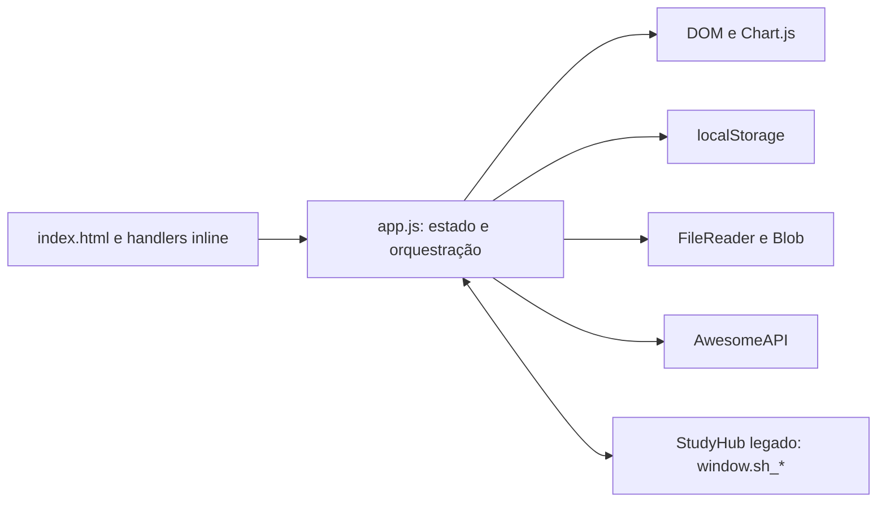

# Arquitetura atual

Baseline auditada: `ab0cb63`. Linhas e contagens abaixo referem-se à baseline;
após extrações, localizar pelos símbolos. Auditoria estrutural, sem afirmar cobertura funcional completa.

## Stack e execução

| Aspecto | Encontrado |
|---|---|
| Linguagem/runtime | JavaScript clássico no navegador, HTML5, CSS3 |
| Framework/estado | Sem framework; variáveis globais e DOM direto |
| Entrada | `index.html` carrega Chart.js, `styles.css`, `app.js`; bootstrap em `window.load` |
| Rotas | `showPage(id)` alterna 15 páginas via classes; sem router ou URL própria |
| Gráficos/fontes | Chart.js 4.4.1 via cdnjs; Google Fonts via CSS |
| Persistência | localStorage; JSON/CSV e relatórios MT4/MT5 via FileReader/Blob |
| Rede | AwesomeAPI, endpoint USD/BRL; chamadas de cotação duplicadas |
| Banco/ORM/auth | Não encontrados; perfil é informação local, sem login |
| Backend/filas/workers/jobs | Não encontrados; atualização de cotação por timer no navegador |
| Package manager/runtime de tooling | Nenhum manifesto ou gerenciador estabelecido na baseline |
| Testes/lint/format/typecheck | Nenhum comando ou suíte versionado na baseline |
| Build | Sem compilação; arquivos estáticos |
| Docker/CI/CD | Sem configuração versionada; README informa publicação Vercel |
| Desenvolvimento | `python3 -m http.server 8000`; `python` ausente no ambiente auditado |

## Fluxo e acoplamento

`trades`, `accounts`, `config`, `preMarketData` e `studyHubState` são estado compartilhado.
`saveTrade` mistura formulário, validação, cálculo, mutação, persistência e renderização.
`save`/`load` serializam o estado; bootstrap normaliza dados e insere exemplos quando não há trades.

Chaves persistidas: `tl_trades`, `tl_config`, `tl_pm`, `tl_accounts`, `tl_activeAccount`,
`tl_studyhub`, `appLanguage`, `appCotacao`, `pfCot`, `pfState`, `cot`, `hubCiclos`, `diary2026`.
Preservar nomes e formatos até uma migração explicitamente planejada.

## Indicadores

- `app.js`: 11.068 linhas; `styles.css`: 6.090; `index.html`: 1.435.
- Contagem textual JS: 515 funções nomeadas, 826 ocorrências `document.`, 160 `.innerHTML`,
  26 chamadas localStorage e 60 atribuições `window.*`.
- HTML principal: 172 handlers inline; 15 páginas.
- `app.js:8378`: atribuição `host.innerHTML` com 156.671 caracteres em uma linha.
- Sem imports/exports na baseline: ciclos de imports não se aplicam; o risco está nas
  dependências globais e na ordem de inicialização. As contagens não substituem um grafo semântico.

## Top 10 hotspots

| Prioridade | Arquivo | Problema | Risco | Estratégia |
|---|---|---|---|---|
| P1 | `app.js` | 11.068 linhas, múltiplos domínios e camadas | Alto | Extrações por responsabilidade com API temporária compatível |
| P1 | `app.js:8378`, `host.innerHTML` | Template legado de 156.671 caracteres numa linha | Alto | Separar recurso preservando montagem e ordem |
| P1 | `app.js:8373–10761`, StudyHub legado | Quatro módulos, estado, gráficos e IO num bundle | Alto | Isolar bundle e depois subfeatures; preservar `sh_*` |
| P1 | `app.js:1124`, `saveTrade` | 116 linhas: validação, cálculo, persistência e UI | Alto | Caracterizar payload e fluxo antes de extrair caso de uso |
| P1 | `app.js:1485`, `calcAccountRiskState` | 186 linhas: calendário, risco e texto formatado | Alto | Fixar tempo nos testes; separar cálculo e apresentação |
| P1 | `app.js:6932–7033`, persistência/bootstrap | Storage global, normalizações, seed e erros silenciados | Alto | Caracterizar restauração e storage antes de adapter |
| P2 | `app.js:2218`, `renderStrategyCompareCards` | Aproximadamente 223 linhas com métricas e HTML | Médio | Separar modelo de apresentação e render |
| P2 | `app.js:3111`, `renderStats` | Aproximadamente 193 linhas de consultas, gráficos e DOM | Médio | Extrair métricas e componentes de gráficos |
| P2 | `styles.css` | Cascata de todas features; legado em `4880–6089` | Médio | Separar mantendo ordem e especificidade |
| P2 | `index.html` | Todas páginas e handlers no shell | Médio | Preservar IDs e contratos antes de separar templates |

P0 = risco estrutural crítico; P1 = alto retorno; P2 = importante; P3 = cosmético.
Nenhum P0 comprovado nesta auditoria. Arquivos acima de 1.000 linhas permanecem temporariamente
como fronteiras legadas: extração ampla sem cobertura aumentaria o risco. Esta é uma exceção
de transição, acompanhada no [roadmap](refactoring-roadmap.md).

## Riscos e limites

- Handlers HTML dependem de nomes globais; conversão imediata para ES modules quebraria esse contrato.
- `renderLog` do diário e do StudyHub vivem em escopos diferentes; preservar IIFEs evita colisões.
- `renderStudyHub` integra código nativo, `window.sh_*` e wrappers intraday dependentes da ordem.
- `fetchCotacao`, `hubFetchCot`, `pfFetchCot` e `ptFetchCot` repetem a mesma rede, com estados distintos.
- `load` silencia exceções; bootstrap sem trades gera exemplos. Não mudar isso incidentalmente.
- Datas misturam relógio atual, UTC e horário local; resultados de risco exigem testes de calendário.
- `calcSaque` e `calcRRRManual` vazios e um ramo `if(false)` são candidatos a código morto,
  não remoções autorizadas sem análise de referências.
- Simulações usam aleatoriedade; caracterização deve controlar a fonte aleatória quando necessário.
- A baseline não oferece testes de regressão nem pipeline. Verificações do primeiro lote serão
  registradas no [progresso](refactoring-progress.md), somente após execução.

Primeira extração concluída: cálculo de dimensionamento da simulação.
Estado atual: `app.js` com 11.055 linhas e domínio novo com 29 linhas. Ver [mapa compacto](project-map.md).
