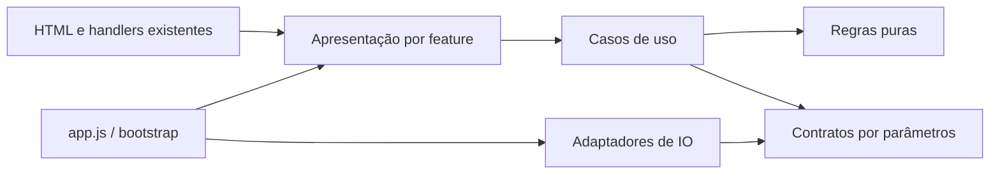

# Análise da modularização do projeto inteiro

Data: 2026-09-11. Referência histórica: `5c9859f`, agora contida na branch `refactor`.
Pedido: reorganizar o projeto existente por responsabilidade, mantendo código e comportamento.
Esta entrega é análise e desenho dos cortes; não é uma reescrita nem uma migração já executada.

## Diagnóstico atual

| Arquivo/área | Medição | Consequência |
|---|---|---|
| `app.js` | 9.770 linhas, 678.012 bytes | Composição, estado, cálculos, UI, IO e StudyHub concentrados |
| `styles.css` | 6.090 linhas, 162.576 bytes | Estilos comuns, páginas, responsividade e correções misturados |
| `index.html` | 1.445 linhas, 97.655 bytes | Shell, 15 páginas, modais e contratos de handlers |
| `src/modules` | 10 arquivos JS extraídos | Sizing, CSV e idiomas; a modularização da lógica ainda é parcial |
| Template StudyHub | Linha 7.080 de `app.js`, 156.671 caracteres | Contagem de linhas subestima o tamanho e o custo de leitura |
| Verificação existente | 3 arquivos de testes, 1 smoke | Cobertura focada nos lotes entregues; não cobre todos os módulos |

Conclusão: separar CSS por contexto e JavaScript por feature é adequado. A migração precisa
considerar a ordem de execução e a cascata, além do tamanho. Página não equivale a domínio:
dashboard e análises compartilham métricas; documentos acessam operações e rotina;
StudyHub agrega quatro ferramentas com estado e nomes próprios.

## Escopo e evidências

- Inventário dos arquivos da aplicação e dos módulos extraídos; mapas e ADRs existentes consultados.
- JavaScript navegado por símbolos Serena, referências e trechos; não é auditoria linha a linha de todos os algoritmos.
- CSS inspecionado por regras, comentários e seletores, com parsing estrutural; HTML por páginas, IDs e handlers.
- Investigações independentes de JS nativo, CSS e HTML; StudyHub, bootstrap e cobertura consolidados separadamente.
- Testes existentes executados novamente: 58 testes, 0 falhas/skip; 18 checks no navegador passaram.
- Esses resultados confirmam somente a cobertura atual, não todos os cálculos, telas ou fluxos de restauração.

## Organização recomendada

```text
src/
  app/                         # composição, bootstrap e navegação
  styles/                      # base, layout e componentes realmente comuns
  modules/
    trades/
    accounts/
    analytics/
    calendar/
    routine/
    simulation/
    data-transfer/
    study-hub/
    documents/
    partners/
    profile/
    notifications/
    preferences/
```

Dentro de cada feature, criar somente as camadas necessárias:

| Camada | Conteúdo concreto | Regra |
|---|---|---|
| `domain` | Resultado de operação, métricas, limites, sizing | Dados explícitos; sem DOM, storage, rede ou Chart.js |
| `application` | Salvar/duplicar operação, importar, preparar consultas | Coordena regras e IO; sem elementos HTML |
| `infrastructure` | localStorage, FileReader, Blob, cotação e formatos externos | Preserva contratos de dados e implementa IO |
| `presentation` | Eventos, formulários, renderização, gráficos e CSS | Consome resultados; evita recalcular regras |
| `legacy` temporário | Bloco existente ainda misturando responsabilidades | Preserva escopo e efeitos até a extração das camadas |

`legacy` é uma exceção documentada por feature, não destino permanente nem depósito compartilhado.
Não criar todas as pastas antecipadamente. CSS comum fica em `src/styles`; CSS específico acompanha
a apresentação da feature. Não duplicar métricas ou persistência para obter um JS por página.



## Estratégia de preservação

1. **Separação física:** mover blocos coesos sem renomear, reformatar ou corrigir regras.
   Conservar scripts clássicos, globals, closures, handlers e sequência de efeitos.
2. **Separação de responsabilidades:** caracterizar entradas/saídas e extrair cálculos puros;
   depois separar leitura da UI, coordenação e IO dentro da feature já localizada.
3. **Limpeza de compatibilidade:** apenas após migrar e verificar todos os consumidores,
   inclusive nomes presentes em strings e no HTML gerado.

Uma movimentação exata pode ser comprovada por comparação de trechos. Uma extração de domínio
precisa também de testes de comportamento. Não considerar uma cópia de função que acessa DOM
como domínio só porque mudou de diretório.

## Regras de carregamento

- Manter o mesmo runtime estático, sem framework, ESM, bundler ou dependência nova incidental.
- Declarações sem efeitos podem carregar antes de `app.js`; inicializadores de estado exigem análise da ordem.
- O bootstrap atual registra `load` antes do bundle StudyHub; seus callbacks e o preenchimento de exemplos são contratos.
- `currentLanguage` e cotação leem storage no nível superior; não antecipar essas leituras ao mover UI.
- Os IIFEs do StudyHub precisam manter isolamento; publicar todas as funções como globals criaria colisões.
- Centralizar a lista ordenada de `<script>`/`<link>` no shell e testar presença única e ordem.
- Manter estado compartilhado na composição inicialmente. Passá-lo explicitamente aos novos cálculos;
  não copiar `trades`, `accounts` ou `config` para estados independentes por página.

## HTML e CSS

HTML estático não possui include nativo. Separar as páginas com `fetch` mudaria a disponibilidade
de IDs no bootstrap e no StudyHub. Manter o shell estático nesta fase; uma montagem de HTML
exigiria desenho e validação próprios. Primeiro extrair CSS e JS, que já suportam arquivos externos.

CSS por página é destino válido, mas a primeira divisão deve preservar blocos contíguos e sua ordem.
As regras tardias de responsividade e compatibilidade não podem ser agrupadas automaticamente
junto das regras iniciais da página. Estilos inline usados como estado também não podem ser movidos mecanicamente.

## Critério de conclusão por lote

- Expectativas do comportamento atual executadas antes da mudança.
- Trechos movidos comparados; nenhum ID, chave de storage, default ou retorno alterado.
- Testes do fluxo afetado, sintaxe, smoke isolado e `git diff --check` aprovados.
- Para CSS: texto/cascata preservados, estilos computados e comparação visual nos breakpoints relevantes.
- Revisão independente, mapa/progresso atualizados e commit conceitual; sem push automático.
- Meta usual: 50–250 linhas; investigar acima de 300. Não criar fragmentos sem responsabilidade para atingir contagem.
- Arquivo temporário acima de 1.000 linhas deve registrar a fronteira que protege e o próximo corte para eliminá-lo.

## Inventários complementares

- [JavaScript por responsabilidade](javascript-extraction-map.md).
- [CSS e ordem de extração](css-extraction-map.md).
- [Páginas e contratos HTML](html-extraction-map.md).
- [Roadmap e sequência de execução](refactoring-roadmap.md).
