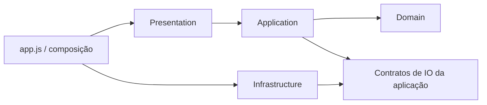

# Arquitetura alvo

Clean Architecture proporcional a uma aplicação estática. Manter JavaScript e deploy sem build.
Criar pastas somente quando houver código para ocupar cada responsabilidade.

| Feature proposta | Domain | Application | Infrastructure | Presentation |
|---|---|---|---|---|
| trades | resultado/normalização de operação | salvar, filtrar e duplicar | persistência de operações | formulário e diário |
| accounts | limites e estado de risco | selecionar/editar conta | storage das contas | contas e resumo de risco |
| analytics | métricas e agregações | consultas por período | apenas se houver IO próprio | dashboard, stats e Chart.js |
| simulation | sizing, expectativa, trajetórias | preparar/executar simulação | aleatoriedade injetada quando necessária | inputs e gráficos |
| data-transfer | regras de compatibilidade de dados | importar/exportar/backup | CSV, MT4/MT5, FileReader/Blob | seleção e feedback |
| study-hub | regras de planejamento | preparar/executar propfirm, plano, simulação e mental | storage legado/adaptadores | workspace e tabs |
| preferences | preferências validadas | idioma e cotação | storage e AwesomeAPI | seletores e formatação |
| calendar | agregação diária/mensal quando isolada | consulta do período | apenas se houver IO próprio | calendário principal e mini |
| routine | estatísticas de hábitos e correlações | atualizar rotina/hábitos | acesso à rotina existente | grade, editor e gráficos |
| documents | normalização de imagens | consultar/salvar/remover anotação por origem | IO das fontes existentes, sem novo banco de documentos | browser, editor e mídia |
| partners | apenas regras efetivamente isoladas | atualizar parceiro/suporte | imagem e clipboard | cards e editor |
| profile | sem domínio próprio por enquanto | projeção de conta/risco | sem IO próprio por enquanto | resumo do perfil, sem autenticação |
| notifications | critérios de alerta quando separados das mensagens | consultar alertas | sem IO próprio por enquanto | mensagens e ações |

Essas fronteiras foram revisadas na [análise global](modularization-analysis.md).
Não mover calendário, rotina, documentos ou perfil para StudyHub apenas por conveniência.
Destinos e dependências concretas: [mapa JS](javascript-extraction-map.md).

Primeiro boundary concreto: `src/modules/simulation/domain/calculate-simulation-sizing.js`.
Demais células descrevem destino, não camadas já implementadas.
O domínio publica temporariamente um namespace; wrappers em `app.js` preservam funções globais.
Não introduzir classes/repositories/DTOs abstratos para funções que já recebem dados simples.
ES modules e remoção de globals exigem decisão separada e testes dos handlers e distribuição.

CSS pertence à apresentação: base/layout/componentes comuns em `src/styles`, estilos de feature
junto de sua apresentação. A primeira extração mantém blocos e ordem da cascata; ver [mapa CSS](css-extraction-map.md).
Shell e bootstrap têm destino em `src/app`; `app.js` permanece a composição durante a transição.
Blocos ainda mistos podem ficar em `legacy` temporário por feature, com dívida e próximo corte documentados.
Mover uma função com DOM/storage para um arquivo `domain` não satisfaz estas regras.
