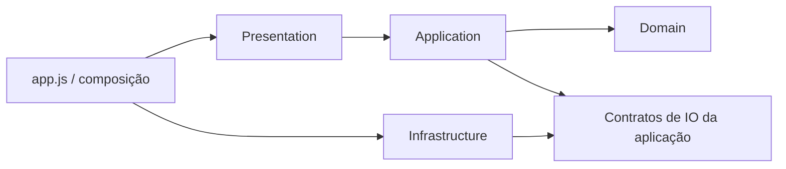

# Arquitetura alvo

Clean Architecture proporcional a uma aplicação estática. Manter JavaScript e deploy sem build.
Criar pastas somente quando houver código para ocupar cada responsabilidade.

| Feature proposta | Domain | Application | Infrastructure | Presentation |
|---|---|---|---|---|
| trades | resultado/normalização de operação | salvar, filtrar e duplicar | persistência de operações | formulário e diário |
| accounts | limites e estado de risco | selecionar/editar conta | storage das contas | contas e resumo de risco |
| analytics | métricas e agregações | consultas por período | apenas se houver IO próprio | dashboard, stats e Chart.js |
| simulation | sizing, expectativa, trajetórias | preparar/executar simulação | aleatoriedade injetada quando necessária | inputs e gráficos |
| data-transfer | regras de compatibilidade de dados | importar/exportar/backup | CSV, MT4/MT5, FileReader/Blob | seleção e feedback |
| study-hub | regras de planejamento | tarefas, documentos e revisão | storage legado/adaptadores | workspace e tabs |
| preferences | preferências validadas | idioma e cotação | storage e AwesomeAPI | seletores e formatação |

Calendário, rotina, documentos e perfil permanecem no mapa atual até lote próprio;
não mover todos para StudyHub apenas por conveniência. Revisar fronteiras com usos reais.

Primeiro boundary concreto: `src/modules/simulation/domain/calculate-simulation-sizing.js`.
Demais células descrevem destino, não camadas já implementadas.
O domínio publica temporariamente um namespace; wrappers em `app.js` preservam funções globais.
Não introduzir classes/repositories/DTOs abstratos para funções que já recebem dados simples.
ES modules e remoção de globals exigem decisão separada e testes dos handlers e distribuição.
